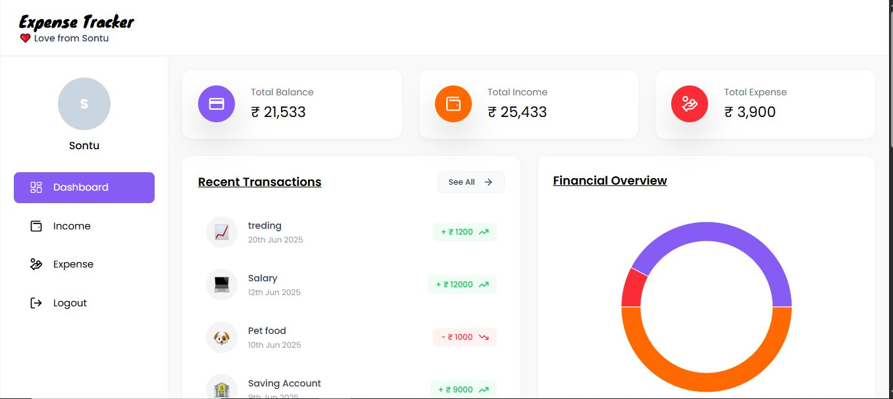

<h1 align="center">Hi 👋, I'm Subhadip Maity</h1>
<h3 align="center">An associate RPA (Robotic Process Automation) Developer || Aspiring MERN Developer</h3>

---

## 💫 About Me

- 🌱 I’m currently an associate RPA Developer at **Centelli India**
- 🎓 MCA graduate with a solid academic background in Computer Science and Mathematics
- 🤖 Transitioning into **AI Automation** with growing interest in integrating AI with RPA
- 📚 Learning **Machine Learning, Data Science, and Deep Learning**
- 💻 Proficient in **C++, Python, C, JavaScript, React, ExpressJs**, MongoDB & MySQL
- 🧠 Strong problem-solving mindset — practicing regularly on **HackerRank** & **LeetCode**
- 🤝 Efficient multitasker, proactive team player, and adaptable in fast-paced environments

---

## 💼 Experience

### 📌 Associate RPA Developer  
**Centelli India**  
_March 2025 – Present_  
- Developed and maintained RPA solutions to automate business processes.

### 📌 MERN Developer  
**Galgotias University**  
_October 2023 – March 2025_  
- Developed and maintained MERN applications for internal university systems.

---

## 💻 Tech Stack

---

## 🚀 Project: Expense Tracker (MERN)

A full-stack **Expense and Income tracker** web app built using MongoDB, Express.js, React, and Node.js.  
Users can track their transactions with visual charts and summaries.

**Tech Stack:** React, Node.js, MongoDB, Tailwind CSS  
🔗 [View Project on GitHub](https://github.com/SontuCoder/Expense-Tracker)

---

## 📊 GitHub Stats

 

---

## 🌐 Connect with Me

---

